# Meta Comic Collectibles

A FiveM collectible resource featuring custom trading cards, challenge coins, plushies, animated openings, card grading, binders, display cases, and placeable vending machines. Players collect physical inventory items while authorized managers build the catalog, print variants, sets, and sealed products in game.

The same React interface runs as a standalone browser lab for designing and previewing content.

## Pictures

### Animated previews

**Vending machine service access:** the main door opens, followed by the server cabinet and cashbox; the cashbox, server cabinet and main door then close in reverse order.

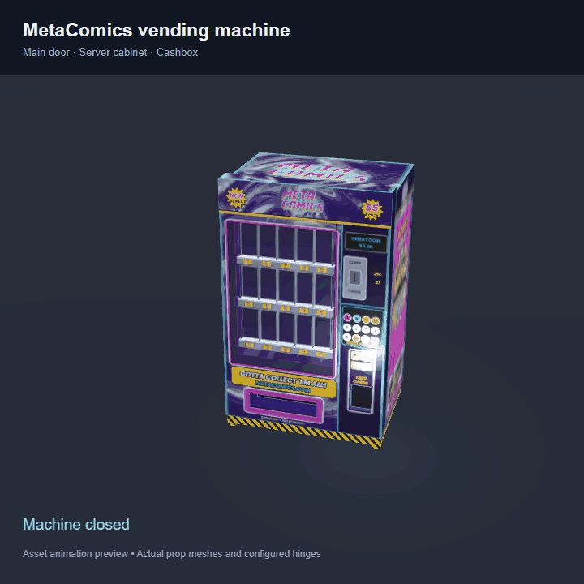

This asset preview uses the current streamed prop meshes, the vending atlas and the hinge positions, directions and opening angles from `fivem/config.lua`. It is rendered outside FiveM with inspection lighting; it demonstrates the moving parts, not an in-game interaction recording.

The following collectible previews were captured from the resource's actual renderers in standalone mode, using bundled/sample artwork. These silent GIFs show the shared NUI presentation; FiveM inventory checks, rewards, and persistence run on the server.

| 3D card pack opening (back peel) | Card inspection and foil |
| --- | --- |
| 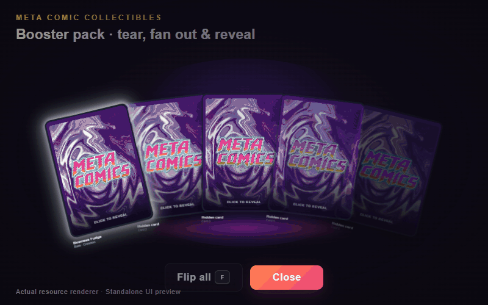 | 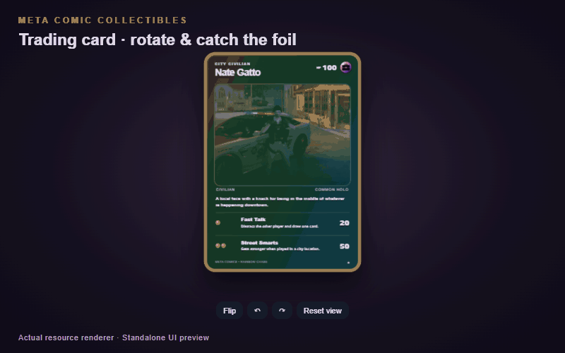 |

| Coin bag opening | Plushie box opening |
| --- | --- |
| 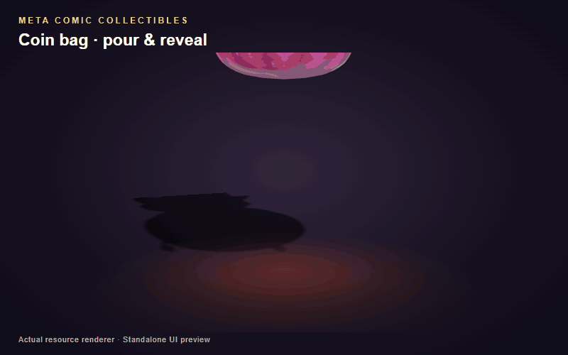 | 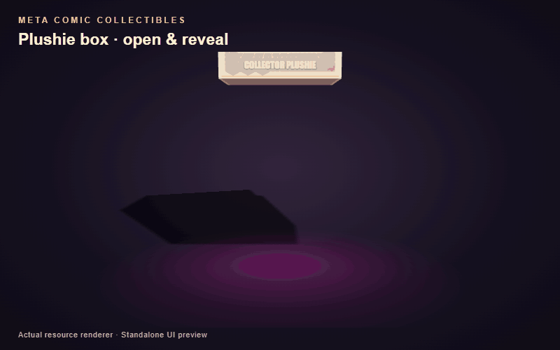 |

| Collectible inspection | Sealed container previews |
| --- | --- |
| 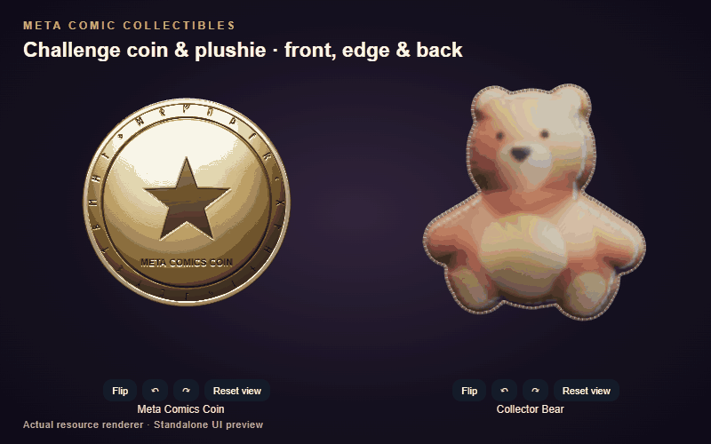 | 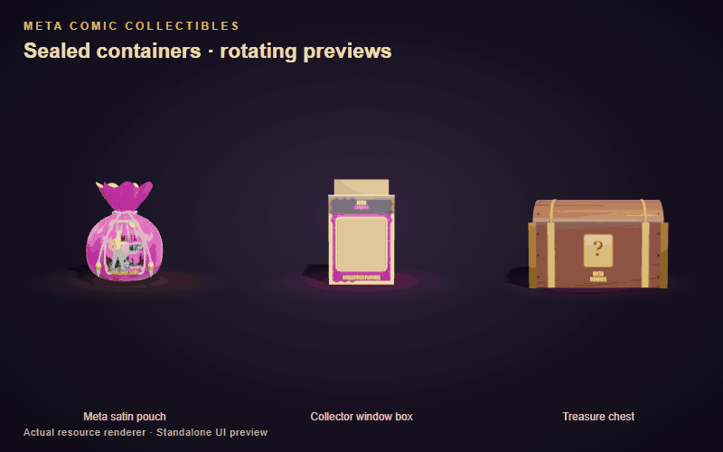 |

**Outer container opening:** a treasure chest unpacks sealed coin bags, which can then be opened individually.

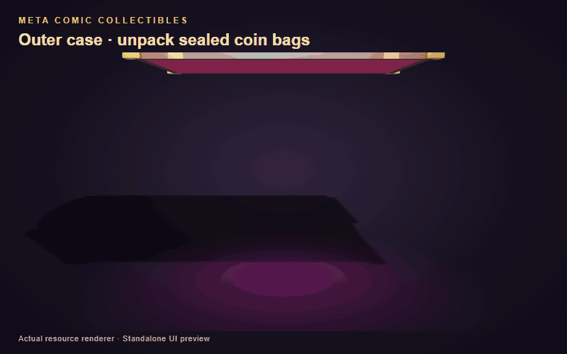

### Trading card prints

<p align="center">
  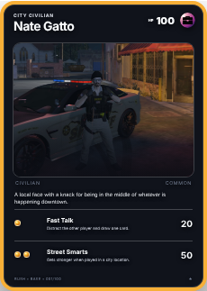
  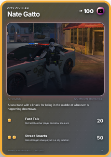
  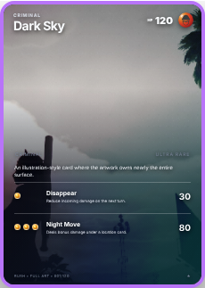
  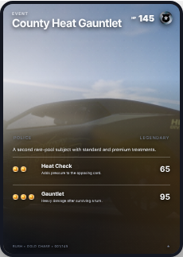
</p>

Bundled card renders show different prints and layouts. Interactive foil, lighting, and rotation are best viewed in the resource.

### Collectibles, containers, and protection

| Challenge coins | Plushies | Card storage and protection |
| --- | --- | --- |
|  |  | 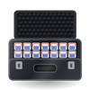 |
|  | 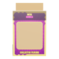 |  |
|  |  |  |

These are bundled inventory/product images, rather than in-game screenshots.

## Features

### Trading cards and effects

- Custom names, stats, attacks, descriptions, colors, front/back artwork, and artwork position/zoom.
- Multiple print variants per base card, with independent names, rarity, pull weights, artwork overrides, layouts, and effects.
- Five rarity tiers: **Common, Uncommon, Rare, Ultra Rare, Legendary**.
- Four layouts: **Classic Frame, Full Art, Illustration Rare, Dark Borderless**.
- Full-card finishes: Rainbow Foil, Prism / Streak, Cosmos Sparkle, Reverse Holo, Etched Foil, Aurora Foil, and Oil Slick, plus an unfoiled option. Holo strength is adjustable from 0–100%.
- Multiple subject layers with independent masks, effect strength, and colors. Effects include rainbow/gold/silver outlines, subject foils, galaxy, flame variants, electricity, water, smoke, and frost.
- Alpha, luminance, and inverted-luminance masks, with runtime remote artwork and mask URLs.
- Large interactive inspection with rotation, tilt, foil lighting, and visible card thickness.
- Acquired items retain their card/print snapshot, so later catalog edits do not change their design.

### Packs, sets, and production

- Animated pack tearing, card fan-out, individual reveals, rare reveal sounds, and **Flip all** (default key: **F**).
- Per-player tear style, fan-out, opening speed, and collectible-container animation preferences, saved through FiveM client KVP.
- Named sets with membership lists and set-bound booster packs/boxes. Cards can belong to multiple sets.
- Server-side pack rolls, exact inventory-slot validation, and item consumption.
- Physical card rewards arrive after the reveal or when the opening closes, keeping inventory notifications from spoiling the pulls.
- Booster boxes dispense sealed packs with the same set identity.
- Manager production controls for sealed inventory items and specific card/print copies. Manual prints are visibly labeled and record their origin.
- Opening labs, print collections, and effect samplers for previewing content.

### Challenge coins and plushies

- Shared Editor, Sets & containers, Collection, Effect sampler, and opening-lab workflows.
- Print variants with rarity, weighted odds, artwork overrides, accents, and finishes.
- Coins with front/back artwork, face framing, rim/edge artwork, and reeded, smooth, rope, studded, or lettered edges.
- Plushies shaped from artwork, with fabric recoloring, front/back images, seam patterns, thread color, and thickness.
- Rotatable 3D inspection, iridescent/metallic/glitter finishes, and 2D fallback views when WebGL is unavailable.
- Coin bags, plushie boxes, and outer cases with multiple designs and opening animations. Contents emerge as silhouettes and reveal on click.
- Material-specific generated sounds for fabric, coins, cardboard, tape, wood, and landing items.
- Server-owned container snapshots and rolls. Pending generic-container deliveries persist for restart recovery and retry when inventory space becomes available.

| Product | Default contents |
| --- | --- |
| Booster pack | 5 cards |
| Booster box | 12 sealed booster packs |
| Coin bag | 3 coins |
| Coin bag box | 10 sealed coin bags |
| Plushie box | 1 plushie |
| Plushie case | 18 sealed plushie boxes |

Counts/settings are configurable. Outer containers dispense sealed inner products that players open separately. Physical card booster boxes currently give packs directly; the browser lab's box animation is a preview.

### Condition, protection, and grading

- Per-copy condition: centering, artwork/text/foil shifts, corner and edge wear, scratches, dents, and creases.
- Handling wear, including wear from aggressive spinning in the viewer.
- Sleeves reduce wear; toploaders and graded slabs stop it.
- Interactive grading bench where players inspect and mark flaws. The server validates findings and suggests a grade.
- Configurable grading permission, slab requirement, incorrect-mark limit, and allowed grade adjustment.
- Certificate records with grade, grader, and confirmed findings; lookup with `/gradecheck <cert>`.
- Optional debugger showing actual flaws and tolerance limits for testing.

### Binders, cases, and sharing

- ox_inventory container binders with nine-pocket pages, clear plastic/sleeve visuals, empty pockets, and enlarged card inspection.
- Drag cards to move/swap binder pockets.
- Card cases supporting raw cards, sleeves, toploaders, and slabs, with compartment, foam, and top-down views.
- Case drag-and-drop between the player's card hand and the case, plus moving/swapping inside the case.
- Show cards, coins, or plushies to nearby players for a configurable time/distance.
- Character-held props when viewing, showing, and revealing collectibles.

### Vending machines

- Streamed Meta Comics vending prop with in-game placement, rotation, moving, and removal.
- Per-machine card-set products, pack/box prices, and stock.
- ox_target interactions and ox_lib menus for buying, restocking, and management.
- Server validation of purchase distance, price, money, stock, and inventory capacity.
- Restocking consumes matching sealed products from inventory, including for managers. Additional jobs can receive restock access.
- Admin map showing machines and stock, with waypoint support.
- Persistent placements/products and distance-based local prop spawning.

### Administration and integrations

- Explicit **Save / Revert** editors with draft-discard prompts.
- Server-checked permissions through ACE, QBCore permissions, jobs, Qbox groups, or identifiers.
- Standalone, QBCore, Qbox, automatic-detection, and custom framework adapters.
- ox_inventory, QBCore inventory, and no-inventory adapters.
- JSON or oxmysql persistence, plus none/custom adapter options. MySQL uses relational definitions and transactional saves.
- Fivemanage inventory icons per distinct appearance, with rarity-picture fallbacks and per-type upload folders/keys.
- Large FiveM RPC payloads use latent events.
- Optional Sample set: 100 illustrated base cards and 800 prints covering rarities, layouts, holo effects, and masks.
- Modular collectible interfaces for extending the resource.

## Requirements

| Component | When needed |
| --- | --- |
| FiveM server | In-game resource hosting |
| Node.js compatible with Vite 7 and npm | Building the UI or running the browser lab; not required on the game server after deployment |
| `qb-core` or `qbx_core` | Corresponding framework adapter |
| ox_inventory or QBCore inventory | Physical items and item-backed gameplay |
| oxmysql and a configured database connection | MySQL persistence |
| ox_target and ox_lib | Vending-machine shop/restock/manage interactions |
| Fivemanage API key | Uploaded inventory icons, editor image uploads, and Sample artwork import |

Binders, card cases, and the supplied grading/protection buttons are configured through the ox_inventory examples. Direct artwork URLs and rarity icons can be used without an upload key. Standalone FiveM with no inventory/database is suitable for testing.

## Installation

### 1. Build the interface

Download or clone the repository, then run from its root:

```sh
npm ci
npm run build
npm run build:fivem
```

`build` creates the browser build in `dist/`. `build:fivem` creates the NUI in `fivem/web/` and synchronizes public image assets into `fivem/img/`. Rebuild after changing UI source or public assets.

### 2. Deploy the resource

Copy the **contents of `fivem/`** into your server resource directory:

```text
resources/[custom]/meta-comic/
├── fxmanifest.lua
├── config.lua
├── client/
├── server/
├── shared/
├── data/
├── img/
├── stream/
└── web/
```

The resource root must contain `fxmanifest.lua` directly. Deploy all bundled folders, not only the UI. A different resource name works, but update every item export/button reference to match. The examples contain both `meta-comic` and `rush-tradingcards` references.

### 3. Choose the runtime

Edit the corresponding values in the deployed `config.lua`:

| Setup | `Config.Framework` | `Config.Inventory` | `Config.Persistence` |
| --- | --- | --- | --- |
| Standalone testing | `'standalone'` | `'none'` | `'json'` |
| QBCore + ox_inventory | `'qbcore'` | `'ox_inventory'` | `'mysql'` or `'json'` |
| QBCore inventory | `'qbcore'` | `'qbcore'` | `'mysql'` or `'json'` |
| Qbox + ox_inventory | `'qbox'` | `'ox_inventory'` | `'mysql'` or `'json'` |
| Auto-detection | `'auto'` | `'auto'` | `'mysql'` or `'json'` |

The checked-in config selects **QBCore + ox_inventory + MySQL**. Auto-detection prefers Qbox over QBCore, and ox_inventory over QBCore inventory. Start dependencies before this resource.

For physical-item gameplay:

```lua
Config.Items.RequireForOpen = true
Config.Items.GiveCardItems = true
Config.Items.BoxGivesPackItems = true
```

For no-inventory testing, use `RequireForOpen = false`. Free lab/command simulations do not produce physical rewards. Inventory item use always consumes the sealed product on the server, regardless of that setting.

### 4. Register inventory items

Merge the appropriate examples into your existing inventory definitions:

- [ox_inventory cards, binders, cases, grading, and protection](fivem/examples/ox_inventory-items.lua).
- [ox_inventory coins, plushies, and their containers](fivem/examples/ox_inventory-collectibles.lua).
- [QBCore items](fivem/examples/qbcore-items.lua), for `qb-core/shared/items.lua`.

For ox_inventory, merge **one route per item** into `ox_inventory/data/items.lua`:

- Framework route: use block A for QBCore/Qbox and keep `Config.Items.RegisterUsableItems = true`.
- Client-export route: use block B, including for standalone + ox_inventory. Replace resource names in `client.export` and button actions.

`Config.Items.UseMethod = 'auto'` enables both supported routes. Keep `consume = 0` in ox_inventory definitions: this resource handles consumption on the server. Card/coin/plushie copies need unique metadata (`stack = false` in ox_inventory; `unique = true` in QBCore). Keep QBCore sealed packs/boxes unique so their set identity survives.

Copy required PNGs from [`fivem/examples/ox_inventory_images/`](fivem/examples/ox_inventory_images/) into `ox_inventory/web/images/` or your inventory's image directory. Additional container-design pictures are in [`fivem/img/containers/`](fivem/img/containers/).

For binders/cases, add the item buttons from the examples and register containers in `ox_inventory/modules/items/containers.lua`:

```lua
setContainerProperties('trading_card_binder', {
    slots = 36,
    maxWeight = 3600,
    whitelist = { 'tradingcard' },
})

setContainerProperties('card_case', {
    slots = 48,
    maxWeight = 6000,
    whitelist = { 'tradingcard' },
})
```

Align these names with `Config.Items.Binder` / `CardCase`. Restart ox_inventory and give **new** containers after changing container definitions. For grading/protection, also register `card_sleeve`, `card_toploader`, and `grading_slab`, and merge their buttons into the trading-card item.

### 5. Configure persistence

**JSON:** set `Config.Persistence = 'json'`. Preserve saved resource `data/` files when updating or moving the server.

**MySQL:** configure your normal oxmysql connection and set:

```lua
Config.Persistence = 'mysql'
Config.Database.Resource = 'oxmysql'
Config.Database.AutoCreateSchema = true
```

Startup creates the required schema and initializes the catalog from seed files on first use. Once initialized, the database owns the definitions; replacing seed JSON does not overwrite the database catalog.

If automatic schema creation is disabled, apply [`fivem/data/mysql.sql`](fivem/data/mysql.sql) and [`fivem/data/collectibles.sql`](fivem/data/collectibles.sql) before startup. For vending, also apply the manual schema in the [vending integration guide](fivem/README.md#vending-machines). Adjust table names consistently if using custom names.

Your inventory system persists physical items and their metadata. SQL card acquisition history records original pulls, rather than tracking current ownership.

### 6. Add permissions and startup order

Example `server.cfg` for QBCore + ox_inventory + MySQL with vending interactions:

```cfg
# Keep your existing database connection and dependency configuration.
ensure oxmysql
ensure ox_lib
ensure qb-core
ensure ox_inventory
ensure ox_target

add_ace group.admin metacomic.manage allow

# Optional Fivemanage uploads: use set, not setr.
set metacomic_fivemanage_key "YOUR_API_KEY"

ensure meta-comic
```

For Qbox use `ensure qbx_core` instead of `qb-core`. Omit dependencies for features/adapters you do not use. Ensure your administrators belong to the granted ACE group, or configure framework/job/identifier permissions under `Config.Management`.

For local vending development/testing, add these server-only settings before `ensure meta-comic`:

```cfg
set metacomic_dev_testing 1
set metacomic_dev_progress_ms 15000 # Use 10000 for a 10-second cap instead.
```

This caps vending crime, hacking, cylinder repair/replacement, and cash box/server rack lock progress at 15 seconds (the optional cap is limited to 10–15 seconds). Already shorter actions keep their configured duration. The server captures the duration when each action starts and validates completion against it. Minigames, loot payouts/batch timings, cooldowns, and the ten-minute automatic security deadline are unchanged. Set `metacomic_dev_testing` to `0` or omit it on production servers to use the original `config.lua` durations. These settings do not depend on `/vendingtestrole`.

API keys belong in **server.cfg**, because `config.lua` is shared with clients. Optional per-type convars are `metacomic_fivemanage_key_cards`, `metacomic_fivemanage_key_coins`, `metacomic_fivemanage_key_plushies`, and `metacomic_fivemanage_key_artwork`. Folder/key selection is configured in `Config.FivemanageFolders`.

Use `Config.CardIcons.Mode = 'rarity'` for local rarity pictures without icon uploads, or `'upload'` for generated per-look icons. The checked-in config uses `'upload'`.

### 7. Create content and verify gameplay

1. Start the server and check the resource log for selected adapters and any schema/item errors.
2. Open `/collectiblesadmin` as an authorized manager. Save definitions and prints, then configure set membership in **Sets & containers**.
3. Create physical sealed products through the production controls, then use those exact inventory items.
4. Reveal the contents, close the opening, and verify the resulting items. Inspect/show a collectible and test a binder/case if enabled.
5. Set `Config.Grading.Debug = false` for normal grading gameplay. The checked-in config enables it for testing and reveals the actual flaw answers.

To import the optional Sample card set, configure an artwork upload key and run `/collectiblessample` as a manager, or `collectiblessample` in the server console. It uploads 150 unique artwork/mask assets and imports 100 base cards with 800 prints. Allow it to finish, then select Sample and create sealed packs. It does not give inventory items or replace other sets. See [Sample setup](fivem/README.md#generate-the-sample-testing-set) for retries and artwork refresh.

## Commands

| Default command | Purpose |
| --- | --- |
| `/collectibles` | Main interface |
| `/collectiblespack` | Pack opening; requires an item when configured |
| `/collectiblesbox` | Box lab/action; item requirements depend on configuration |
| `/collectiblesoptions` | Per-player opening preferences |
| `/collectiblesadmin` | Restricted editing, sets, and production |
| `/collectiblesicons` | Refresh inventory icons; console use retries missing icons |
| `/collectiblessample` | Import Sample cards; management permission required |
| `/gradecheck <cert>` | Look up a grading certificate |
| `/placevending` | Place a machine; management permission required |
| `/removevending` | Remove the nearest machine in range; management permission required |

Main command names are configurable. Legacy `/cards`, `/cardpack`, `/cardbox`, `/cardoptions`, `/cardadmin`, and `/cardicons` aliases remain available. Recovery/artwork-maintenance commands are documented in the [integration guide](fivem/README.md).

## Vending setup

Start ox_target and ox_lib, enable `Config.VendingMachines`, and use `/placevending`. Aim to position the preview, rotate with the mouse wheel or Q/E (Shift for fine steps), and confirm with left click/Enter. Cancel with right click, Backspace, or Esc.

Use **Manage** to choose card sets, packs/boxes, and prices. Use **Restock** with matching physical sealed products. New machines use `Shop.Items`; additional restock jobs and the stock cap are configured under `Restock`. `Shop.Account` selects payment through the configured inventory/framework. The shop currently sells card packs/boxes.

Restocking checks that you hold the full requested quantity before starting. `Work.Restock.PackBatch` (default 2) and `BoxBatch` (default 1) set the units loaded per progress bar. `FullStockMs` defaults to 30000: filling one product to its configured pack or box capacity uses at most 30 seconds of progress time, allocated across its batches. Smaller loads take proportionally less time; network round trips add a little overhead. Set `FullStockMs = 0` to use only `BaseMs`, `PerUnitMs` and the per-batch `MaxMs`. The animation continues across progress bars. Each completed batch consumes inventory and updates machine stock. Interrupting stops the remaining batches and keeps completed ones. Key authentication survives walking away or client prop unloading, but still expires after `Keys.SessionSeconds` (default 300), and every action requires proximity and the current physical key.

The admin **Vending machines** tab shows locations and stock. Configure `Config.VendingMachines.Map.Image` and coordinate alignment for a custom map; a grid is used without an image.

## Artwork and masks

Use direct image URLs or editor upload controls. Uploads require a Fivemanage key; runtime remote URLs work in both FiveM NUI and the standalone lab.

For subject effects, keep cutouts/masks on the **same canvas size and alignment** as the artwork. A 1920×1080 artwork needs a 1920×1080 subject image with the background removed. Do not trim the transparent space around the subject. Use alpha masking for transparent cutouts, or luminance/inverted luminance for mask-only images.

## Updating an existing server

Back up the database and resource data. Keep the resource folder name to preserve resource-scoped saves and player KVP preferences. Deploy updated Lua, manifest, stream/assets, and rebuilt UI together. Merge new configuration fields into your existing `config.lua`, preserving framework, inventory, commands, item names, permissions, and gameplay values.

The MySQL adapter handles legacy table-prefix migration before loading definitions. Do not pre-create new default tables during a legacy upgrade: if old/new names both exist, startup stops for manual review. Read the [upgrade and migration guide](fivem/README.md#existing-installation-upgrade) before updating a live installation.

## Troubleshooting

| Problem | Check |
| --- | --- |
| Item use does nothing | Dependency order, adapter/item names, use route, and export resource names |
| Double consumption | Keep ox_inventory `consume = 0`; the server consumes products |
| Admin/save denied | Management grants, `Config.Management`, `Config.Catalog.AllowWrite`, and `Config.Nui.AllowEditor` |
| Empty catalog or invalid set | Saved definitions/membership and default set; MySQL uses persisted definitions after initialization |
| No command rewards | Free simulations give no items; test using a produced inventory product |
| Binder/case has no pockets | Register item and container properties, restart ox_inventory, and create a new container |
| Fallback inventory pictures | Upload key/mode, a connected player's loaded NUI, artwork access, and inventory URL-host restrictions |
| Coins/plushies unavailable after upgrade | Deploy complete Lua/shared/module files and manifest, not only `web/` |
| Missing vending menus | Start ox_target/ox_lib and enable the shop |

## Standalone browser lab and development

```sh
npm ci
npm run dev
```

Open the Vite URL, normally `http://localhost:5173`. Browser data is stored in localStorage separately from FiveM. Use available JSON export controls to back up card authoring work. Browser edits do not automatically synchronize to the game server.

```sh
npm run build          # Browser production build
npm run preview        # Preview the browser build
npm run build:fivem    # Build and synchronize FiveM UI/assets
```

Generate a card seed catalog from bundled defaults or a card JSON export:

```sh
npm run catalog:fivem
node scripts/export-fivem-catalog.mjs ./my-card-export.json
```

These overwrite `fivem/data/catalog.json`; back up custom seeds first. They do not replace an initialized MySQL catalog. Use in-game management for normal server editing.

For exports, advanced persistence, icons, and recovery, see the [FiveM integration guide](fivem/README.md). For collectible schemas and extension points, see [Collectible systems](docs/collectible-modules.md).
